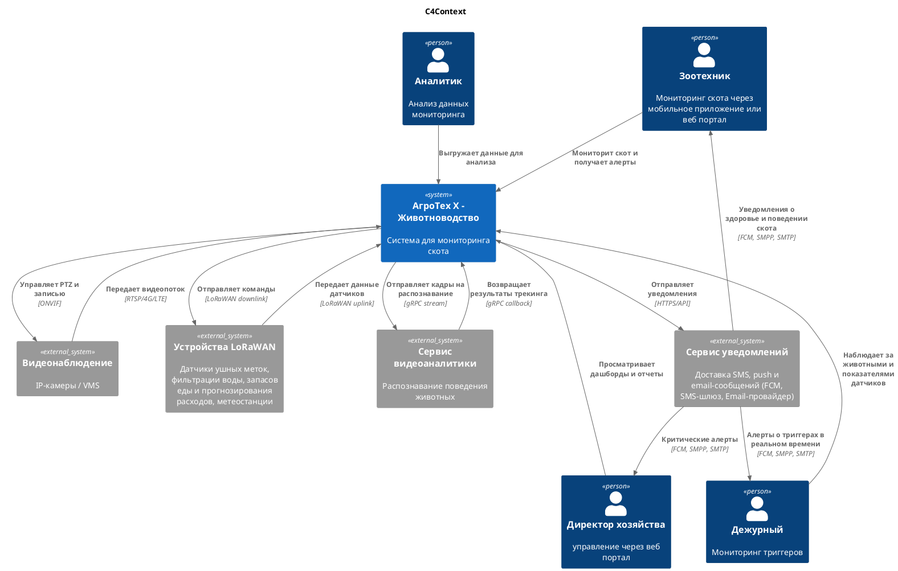

```puml
@startuml
!include <C4/C4_Context>

!$ELEMENT_FONT_SIZE = 10
!$ELEMENT_FONT_COLOR = "#000000"
!$TECH_FONT_SIZE = 8
!$TECH_FONT_COLOR = "#666666"
!$DESCR_FONT_SIZE = 9

!$PERSON_ICON_SIZE = 32
!$SYSTEM_ICON_SIZE = 32
!$EXTERNAL_SYSTEM_ICON_SIZE = 32
!$ICON_SIZE = 32

title C4Context

Person(zootech,"Зоотехник","Мониторинг скота через мобильное приложение или веб портал")
Person(directorOfTheFarm, "Директор хозяйства", "управление через веб портал")
Person(analytic, "Аналитик", "Анализ данных мониторинга")
Person(employee, "Дежурный", "Мониторинг триггеров")

System(agroSystem,"АгроТех Х - Животноводство","Система для мониторинга скота")

System_Ext(cctv,"Видеонаблюдение","IP-камеры / VMS")
System_Ext(lora_devices, "Устройства LoRaWAN", "Датчики ушных меток, фильтрации воды, запасов еды и прогнозирования расходов, метеостанции")
System_Ext(aiTracking, "Сервис видеоаналитики", "Распознавание поведения животных")
System_Ext(notificationService, "Сервис уведомлений", "Доставка SMS, push и email-сообщений (FCM, SMS-шлюз, Email-провайдер)")
Rel(zootech, agroSystem, "Мониторит скот и получает алерты")
Rel(directorOfTheFarm, agroSystem, "Просматривает дашборды и отчеты")
Rel(analytic, agroSystem, "Выгружает данные для анализа")
Rel(cctv, agroSystem, "Передает видеопоток","RTSP/4G/LTE")
Rel(lora_devices, agroSystem, "Передает данные датчиков", "LoRaWAN uplink")
Rel(employee, agroSystem, "Наблюдает за животными и показателями датчиков")
Rel(agroSystem, cctv, "Управляет PTZ и записью", "ONVIF")
Rel(agroSystem, lora_devices, "Отправляет команды", "LoRaWAN downlink")
Rel(agroSystem, notificationService, "Отправляет уведомления", "HTTPS/API")
Rel(agroSystem, aiTracking, "Отправляет кадры на распознавание", "gRPC stream")
Rel(aiTracking, agroSystem, "Возвращает результаты трекинга", "gRPC callback")
Rel(notificationService, employee, "Алерты о триггерах в реальном времени", "FCM, SMPP, SMTP")
Rel(notificationService, zootech, "Уведомления о здоровье и поведении скота", "FCM, SMPP, SMTP")
Rel(notificationService, directorOfTheFarm, "Критические алерты", "FCM, SMPP, SMTP")
@enduml
```