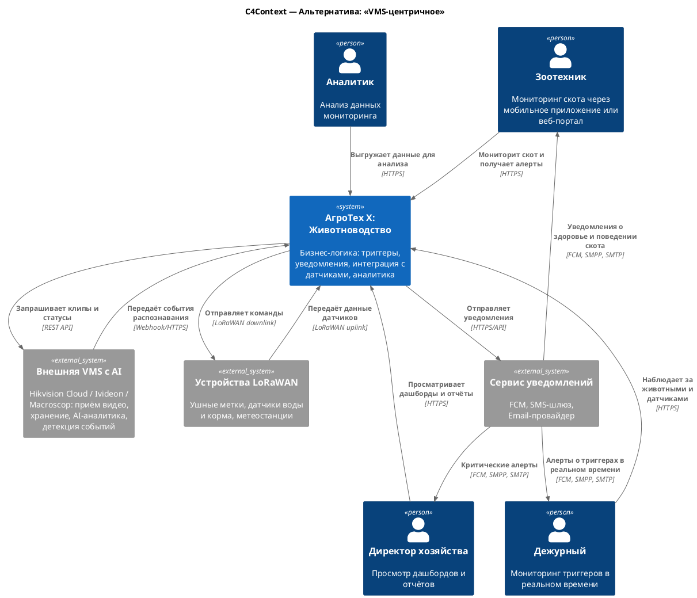

```puml
@startuml
!include <C4/C4_Context>

title C4Context — Альтернатива: «VMS-центричное»

Person(zootech, "Зоотехник", "Мониторинг скота через мобильное приложение или веб-портал")
Person(directorOfTheFarm, "Директор хозяйства", "Просмотр дашбордов и отчётов")
Person(analytic, "Аналитик", "Анализ данных мониторинга")
Person(employee, "Дежурный", "Мониторинг триггеров в реальном времени")

System(agroSystem, "АгроТех Х: Животноводство","Бизнес-логика: триггеры, уведомления, интеграция с датчиками, аналитика")

System_Ext(vms, "Внешняя VMS с AI","Hikvision Cloud / Ivideon / Macroscop: приём видео, хранение, AI-аналитика, детекция событий")
System_Ext(lora_devices, "Устройства LoRaWAN","Ушные метки, датчики воды и корма, метеостанции")
System_Ext(notificationService, "Сервис уведомлений","FCM, SMS-шлюз, Email-провайдер")

Rel(zootech, agroSystem, "Мониторит скот и получает алерты", "HTTPS")
Rel(directorOfTheFarm, agroSystem, "Просматривает дашборды и отчёты", "HTTPS")
Rel(analytic, agroSystem, "Выгружает данные для анализа", "HTTPS")
Rel(employee, agroSystem, "Наблюдает за животными и датчиками", "HTTPS")

Rel(vms, agroSystem, "Передаёт события распознавания", "Webhook/HTTPS")
Rel(agroSystem, vms, "Запрашивает клипы и статусы", "REST API")

Rel(lora_devices, agroSystem, "Передаёт данные датчиков", "LoRaWAN uplink")
Rel(agroSystem, lora_devices, "Отправляет команды", "LoRaWAN downlink")

Rel(agroSystem, notificationService, "Отправляет уведомления", "HTTPS/API")
Rel(notificationService, employee, "Алерты о триггерах в реальном времени", "FCM, SMPP, SMTP")
Rel(notificationService, zootech, "Уведомления о здоровье и поведении скота", "FCM, SMPP, SMTP")
Rel(notificationService, directorOfTheFarm, "Критические алерты", "FCM, SMPP, SMTP")

@enduml
```