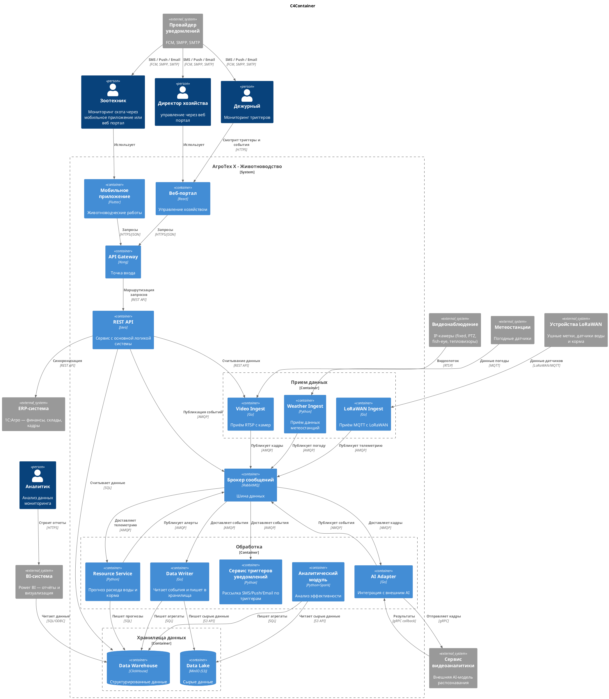

```puml
@startuml
!include <C4/C4_Container>

!$ELEMENT_FONT_SIZE = 10
!$ELEMENT_FONT_COLOR = "#000000"
!$TECH_FONT_SIZE = 8
!$TECH_FONT_COLOR = "#666666"
!$DESCR_FONT_SIZE = 9

!$PERSON_ICON_SIZE = 32
!$SYSTEM_ICON_SIZE = 32
!$EXTERNAL_SYSTEM_ICON_SIZE = 32
!$ICON_SIZE = 32

title C4Container

Person(zootech,"Зоотехник","Мониторинг скота через мобильное приложение или веб портал")
Person(directorOfTheFarm, "Директор хозяйства", "управление через веб портал")
Person(analytic, "Аналитик", "Анализ данных мониторинга")
Person(employee, "Дежурный", "Мониторинг триггеров")
System_Boundary(agroSystem, "АгроТех Х - Животноводство") {
    Container(rabbitMQ, "Брокер сообщений ", "RabbitMQ", "Шина данных")
    Container(web, "Веб-портал","React","Управление хозяйством")
    Container(mobileApp, "Мобильное приложение", "Flutter", "Животноводческие работы")
    Container_Boundary(processing, "Обработка") {
        Container(aiAdapter, "AI Adapter", "Go", "Интеграция с внешним AI")
        Container(resourceService, "Resource Service", "Python", "Прогноз расхода воды и корма")
        Container(moduleAnalytic,"Аналитический модуль", "Python+Spark", "Анализ эффективности")
        Container(notifications, "Сервис триггеров уведомлений", "Python", "Рассылка SMS/Push/Email по триггерам")
        Container(dataWriter, "Data Writer", "Go", "Читает события и пишет в хранилища")
    }
    Container_Boundary(ingestion, "Прием данных") {
        Container(videoIngest, "Video Ingest", "Go", "Приём RTSP с камер")
        Container(loraIngest, "LoRaWAN Ingest", "Go", "Приём MQTT с LoRaWAN")
        Container(weatherIngest, "Weather Ingest", "Python", "Приём данных метеостанций")
    }
    Container_Boundary(dataStorage,"Хранилища данных") {
        ContainerDb(dataLake, "Data Lake", "MinIO (S3)", "Сырые данные")
        ContainerDb(dataWarehouse, "Data Warehouse", "ClickHouse", "Структурированные данные")
    }
    Container(apiGateway, "API Gateway", "Kong", "Точка входа")
    Container(coreApi, "REST API", "Java", "Сервис с основной логикой системы")
}
System_Ext(weatherStations, "Метеостанции", "Погодные датчики")
System_Ext(erpSystem, "ERP-система", "1C:Агро — финансы, склады, кадры")
System_Ext(biSystem, "BI-система", "Power BI — отчёты и визуализация")
System_Ext(notificationProvider, "Провайдер уведомлений", "FCM, SMPP, SMTP")
System_Ext(cctv, "Видеонаблюдение", "IP-камеры (fixed, PTZ, fish-eye, тепловизоры)")
System_Ext(aiTracking, "Сервис видеоаналитики", "Внешняя AI-модель распознавания")
System_Ext(loraDevices, "Устройства LoRaWAN", "Ушные метки, датчики воды и корма")

Rel(apiGateway, coreApi, "Маршрутизация запросов", "REST API")
Rel(coreApi, rabbitMQ, "Публикация событий", "AMQP")
Rel(coreApi, dataWarehouse, "Считывает данные", "SQL")
Rel(coreApi, videoIngest, "Считывание данных", "REST API")
Rel(zootech, mobileApp, "Использует")
Rel(analytic, biSystem, "Строит отчеты","HTTPS")
Rel(employee, web, "Смотрит триггеры и события", "HTTPS")

Rel(mobileApp, apiGateway, "Запросы", "HTTPS/JSON")
Rel(coreApi, erpSystem, "Синхронизация", "REST API")
Rel(web, apiGateway, "Запросы", "HTTPS/JSON")

Rel(moduleAnalytic, dataLake, "Читает сырые данные", "S3 API")
Rel(biSystem, dataWarehouse, "Читает данные", "SQL/ODBC")
Rel(moduleAnalytic, dataWarehouse, "Пишет агрегаты", "SQL")

Rel(loraDevices, loraIngest, "Данные датчиков", "LoRaWAN/MQTT")
Rel(cctv, videoIngest, "Видеопоток", "RTSP")
Rel(aiAdapter, aiTracking, "Отправляет кадры", "gRPC")
Rel(aiTracking, aiAdapter, "Результаты", "gRPC callback")

Rel(videoIngest, rabbitMQ, "Публикует кадры", "AMQP")
Rel(loraIngest, rabbitMQ, "Публикует телеметрию", "AMQP")
Rel(rabbitMQ, aiAdapter, "Доставляет кадры", "AMQP")
Rel(aiAdapter, rabbitMQ, "Публикует события", "AMQP")
Rel(rabbitMQ, notifications, "Доставляет события", "AMQP")
Rel(directorOfTheFarm, web, "Использует")

Rel(rabbitMQ, dataWriter, "Доставляет события", "AMQP")
Rel(dataWriter, dataLake, "Пишет сырые данные", "S3 API")
Rel(dataWriter, dataWarehouse, "Пишет агрегаты", "SQL")

Rel(notificationProvider, employee, "SMS / Push / Email", "FCM, SMPP, SMTP")
Rel(notificationProvider, zootech, "SMS / Push / Email", "FCM, SMPP, SMTP")
Rel(notificationProvider, directorOfTheFarm, "SMS / Push / Email", "FCM, SMPP, SMTP")

Rel(rabbitMQ, resourceService, "Доставляет телеметрию", "AMQP")
Rel(resourceService, dataWarehouse, "Пишет прогнозы", "SQL")
Rel(resourceService, rabbitMQ, "Публикует алерты", "AMQP")
Rel(weatherStations, weatherIngest, "Данные погоды", "MQTT")
Rel(weatherIngest, rabbitMQ, "Публикует погоду", "AMQP")
@enduml
```