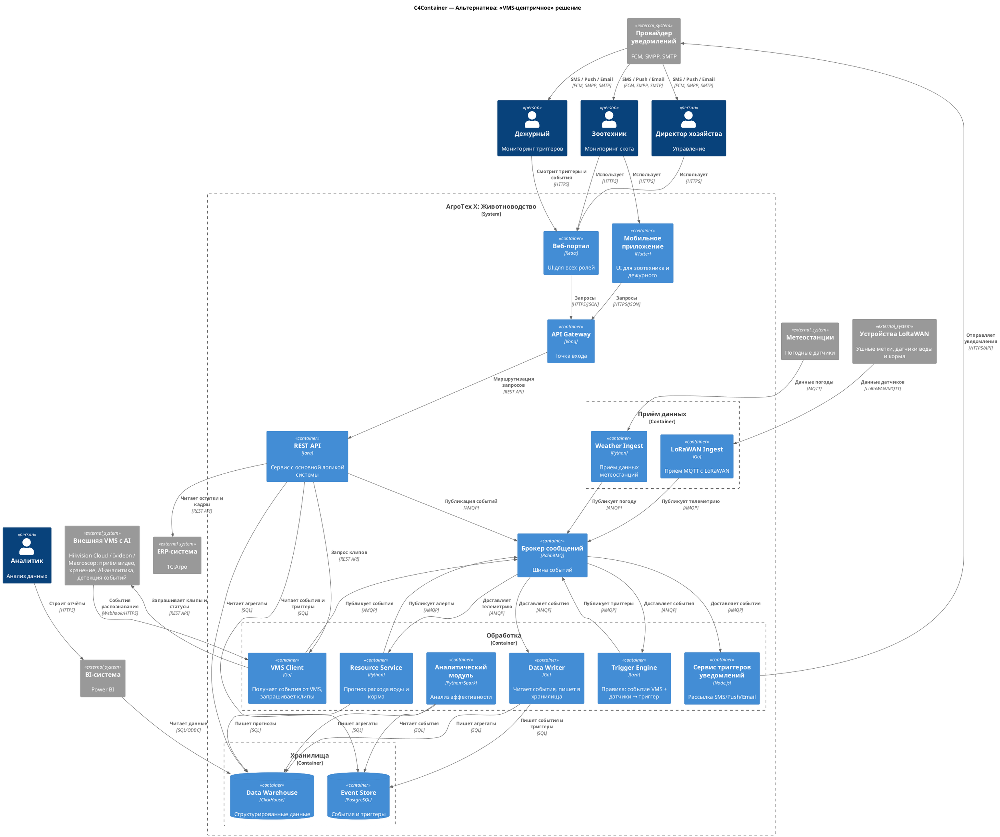

```puml
@startuml
!include <C4/C4_Container>

!$ELEMENT_FONT_SIZE = 10
!$ELEMENT_FONT_COLOR = "#000000"
!$TECH_FONT_SIZE = 8
!$TECH_FONT_COLOR = "#666666"
!$DESCR_FONT_SIZE = 9

!$PERSON_ICON_SIZE = 32
!$SYSTEM_ICON_SIZE = 32
!$EXTERNAL_SYSTEM_ICON_SIZE = 32
!$ICON_SIZE = 32

title C4Container — Альтернатива: «VMS-центричное» решение

Person(zootech, "Зоотехник", "Мониторинг скота")
Person(directorOfTheFarm, "Директор хозяйства", "Управление")
Person(analytic, "Аналитик", "Анализ данных")
Person(employee, "Дежурный", "Мониторинг триггеров")

System_Boundary(agroSystem, "АгроТех Х: Животноводство") {
    Container(web, "Веб-портал", "React", "UI для всех ролей")
    Container(mobileApp, "Мобильное приложение", "Flutter", "UI для зоотехника и дежурного")
    Container(apiGateway, "API Gateway", "Kong", "Точка входа")
    Container(coreApi, "REST API", "Java", "Сервис с основной логикой системы")

    Container_Boundary(processing, "Обработка") {
        Container(vmsClient, "VMS Client", "Go", "Получает события от VMS, запрашивает клипы")
        Container(triggerEngine, "Trigger Engine", "Java", "Правила: событие VMS + датчики → триггер")
        Container(notifications, "Сервис триггеров уведомлений", "Node.js", "Рассылка SMS/Push/Email")
        Container(resourceService, "Resource Service", "Python", "Прогноз расхода воды и корма")
        Container(moduleAnalytic, "Аналитический модуль", "Python+Spark", "Анализ эффективности")
        Container(dataWriter, "Data Writer", "Go", "Читает события, пишет в хранилища")
    }

    Container_Boundary(ingestion, "Приём данных") {
        Container(loraIngest, "LoRaWAN Ingest", "Go", "Приём MQTT с LoRaWAN")
        Container(weatherIngest, "Weather Ingest", "Python", "Приём данных метеостанций")
    }

    Container_Boundary(storage, "Хранилища") {
        ContainerDb(dataWarehouse, "Data Warehouse", "ClickHouse", "Структурированные данные")
        ContainerDb(eventStore, "Event Store", "PostgreSQL", "События и триггеры")
    }
    
    Container(rabbitMQ, "Брокер сообщений", "RabbitMQ", "Шина событий")
}

System_Ext(vms, "Внешняя VMS с AI", "Hikvision Cloud / Ivideon / Macroscop: приём видео, хранение, AI-аналитика, детекция событий")
System_Ext(loraDevices, "Устройства LoRaWAN", "Ушные метки, датчики воды и корма")
System_Ext(weatherStations, "Метеостанции", "Погодные датчики")
System_Ext(erpSystem, "ERP-система", "1С:Агро")
System_Ext(biSystem, "BI-система", "Power BI")
System_Ext(notificationProvider, "Провайдер уведомлений", "FCM, SMPP, SMTP")

Rel(zootech, mobileApp, "Использует", "HTTPS")
Rel(zootech, web, "Использует", "HTTPS")
Rel(directorOfTheFarm, web, "Использует", "HTTPS")
Rel(employee, web, "Смотрит триггеры и события", "HTTPS")
Rel(analytic, biSystem, "Строит отчёты", "HTTPS")
Rel(web, apiGateway, "Запросы", "HTTPS/JSON")
Rel(mobileApp, apiGateway, "Запросы", "HTTPS/JSON")
Rel(apiGateway, coreApi, "Маршрутизация запросов", "REST API")
Rel(coreApi, eventStore, "Читает события и триггеры", "SQL")
Rel(coreApi, dataWarehouse, "Читает агрегаты", "SQL")
Rel(coreApi, rabbitMQ, "Публикация событий", "AMQP")
Rel(coreApi, vmsClient, "Запрос клипов", "REST API")
Rel(coreApi, erpSystem, "Читает остатки и кадры", "REST API")
Rel(vms, vmsClient, "События распознавания", "Webhook/HTTPS")
Rel(vmsClient, vms, "Запрашивает клипы и статусы", "REST API")
Rel(vmsClient, rabbitMQ, "Публикует события", "AMQP")
Rel(loraDevices, loraIngest, "Данные датчиков", "LoRaWAN/MQTT")
Rel(weatherStations, weatherIngest, "Данные погоды", "MQTT")
Rel(loraIngest, rabbitMQ, "Публикует телеметрию", "AMQP")
Rel(weatherIngest, rabbitMQ, "Публикует погоду", "AMQP")
Rel(rabbitMQ, triggerEngine, "Доставляет события", "AMQP")
Rel(triggerEngine, rabbitMQ, "Публикует триггеры", "AMQP")
Rel(rabbitMQ, notifications, "Доставляет события", "AMQP")
Rel(notifications, notificationProvider, "Отправляет уведомления", "HTTPS/API")
Rel(rabbitMQ, resourceService, "Доставляет телеметрию", "AMQP")
Rel(resourceService, dataWarehouse, "Пишет прогнозы", "SQL")
Rel(resourceService, rabbitMQ, "Публикует алерты", "AMQP")
Rel(rabbitMQ, dataWriter, "Доставляет события", "AMQP")
Rel(dataWriter, dataWarehouse, "Пишет агрегаты", "SQL")
Rel(dataWriter, eventStore, "Пишет события и триггеры", "SQL")
Rel(moduleAnalytic, eventStore, "Читает события", "SQL")
Rel(moduleAnalytic, dataWarehouse, "Пишет агрегаты", "SQL")
Rel(biSystem, dataWarehouse, "Читает данные", "SQL/ODBC")
Rel(notificationProvider, employee, "SMS / Push / Email", "FCM, SMPP, SMTP")
Rel(notificationProvider, zootech, "SMS / Push / Email", "FCM, SMPP, SMTP")
Rel(notificationProvider, directorOfTheFarm, "SMS / Push / Email", "FCM, SMPP, SMTP")

@enduml
```