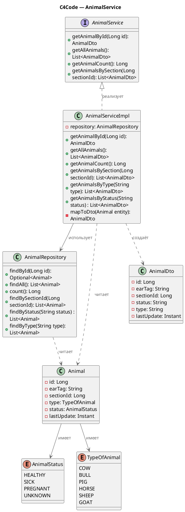

```puml
@startuml
!include <C4/C4_Component>

title C4Code — AnimalService

interface AnimalService {
+ getAnimalById(Long id): AnimalDto
+ getAllAnimals(): List<AnimalDto>
+ getAnimalCount(): Long
+ getAnimalsBySection(Long sectionId): List<AnimalDto>
}

class AnimalServiceImpl {
- repository: AnimalRepository
+ getAnimalById(Long id): AnimalDto
+ getAllAnimals(): List<AnimalDto>
+ getAnimalCount(): Long
+ getAnimalsBySection(Long sectionId): List<AnimalDto>
+ getAnimalsByType(String type): List<AnimalDto>
+ getAnimalsByStatus(String status) : List<AnimalDto>
- mapToDto(Animal entity): AnimalDto
}

class AnimalRepository {
+ findById(Long id): Optional<Animal>
+ findAll(): List<Animal>
+ count(): Long
+ findBySectionId(Long sectionId): List<Animal>
+ findByStatus(String status) : List<Animal>
+ findByType(String type): List<Animal>
}

class Animal {
- id: Long
- earTag: String
- sectionId: Long
- type: TypeOfAnimal
- status: AnimalStatus
- lastUpdate: Instant 
}

class AnimalDto {
- id: Long
- earTag: String
- sectionId: Long
- status: String
- type: String
- lastUpdate: Instant
}

enum AnimalStatus {
HEALTHY
SICK
PREGNANT
UNKNOWN
}

enum TypeOfAnimal {
COW
BULL
PIG
HORSE
SHEEP
GOAT
}

AnimalService <|.. AnimalServiceImpl : реализует
AnimalServiceImpl --> AnimalRepository : использует
AnimalServiceImpl ..> AnimalDto : создаёт
AnimalRepository ..> Animal : читает
AnimalServiceImpl ..> Animal : читает
Animal --> AnimalStatus : имеет
Animal --> TypeOfAnimal : имеет

@enduml
```