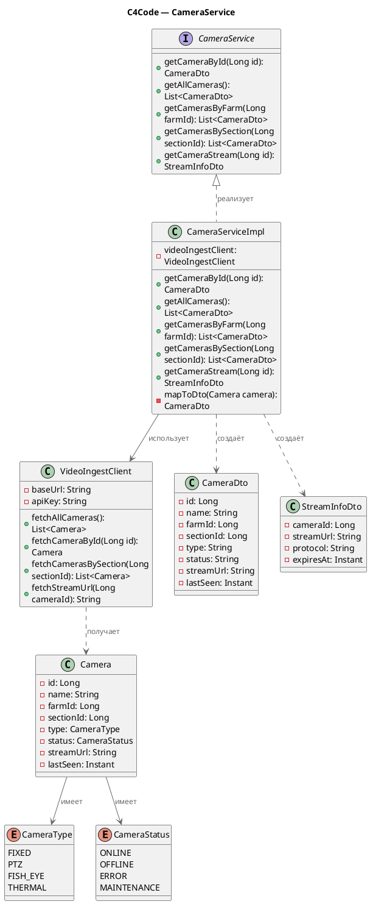

```puml
@startuml
!include <C4/C4_Component>

title C4Code — CameraService

interface CameraService {
+ getCameraById(Long id): CameraDto
+ getAllCameras(): List<CameraDto>
+ getCamerasByFarm(Long farmId): List<CameraDto>
+ getCamerasBySection(Long sectionId): List<CameraDto>
+ getCameraStream(Long id): StreamInfoDto
}

class CameraServiceImpl {
- videoIngestClient: VideoIngestClient
+ getCameraById(Long id): CameraDto
+ getAllCameras(): List<CameraDto>
+ getCamerasByFarm(Long farmId): List<CameraDto>
+ getCamerasBySection(Long sectionId): List<CameraDto>
+ getCameraStream(Long id): StreamInfoDto
- mapToDto(Camera camera): CameraDto
}

class VideoIngestClient {
- baseUrl: String
- apiKey: String
+ fetchAllCameras(): List<Camera>
+ fetchCameraById(Long id): Camera
+ fetchCamerasBySection(Long sectionId): List<Camera>
+ fetchStreamUrl(Long cameraId): String
}

class Camera {
- id: Long
- name: String
- farmId: Long
- sectionId: Long
- type: CameraType
- status: CameraStatus
- streamUrl: String
- lastSeen: Instant
}

class CameraDto {
- id: Long
- name: String
- farmId: Long
- sectionId: Long
- type: String
- status: String
- streamUrl: String
- lastSeen: Instant
}

class StreamInfoDto {
- cameraId: Long
- streamUrl: String
- protocol: String
- expiresAt: Instant
}

enum CameraType {
FIXED
PTZ
FISH_EYE
THERMAL
}

enum CameraStatus {
ONLINE
OFFLINE
ERROR
MAINTENANCE
}

CameraService <|.. CameraServiceImpl : реализует
CameraServiceImpl --> VideoIngestClient : использует
CameraServiceImpl ..> CameraDto : создаёт
CameraServiceImpl ..> StreamInfoDto : создаёт
VideoIngestClient ..> Camera : получает
Camera --> CameraType : имеет
Camera --> CameraStatus : имеет

@enduml
```