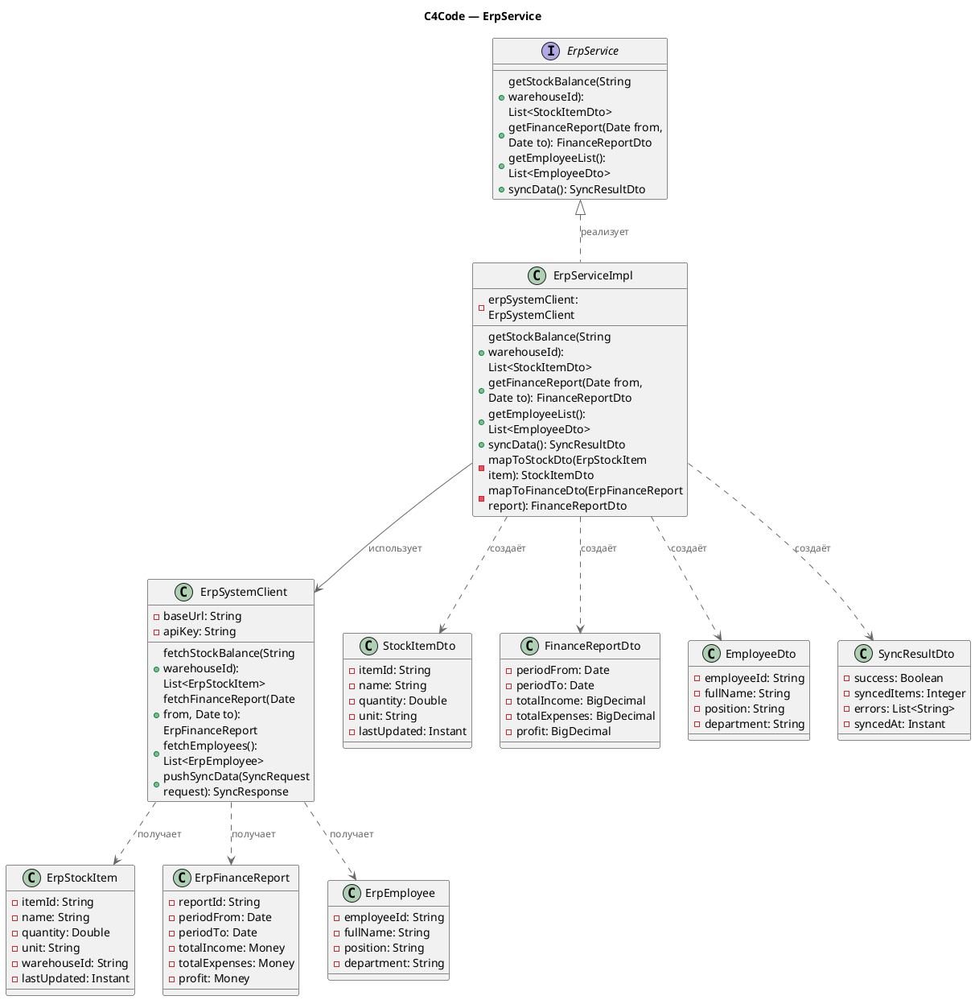

```puml
@startuml
!include <C4/C4_Component>

title C4Code — ErpService

interface ErpService {
+ getStockBalance(String warehouseId): List<StockItemDto>
+ getFinanceReport(Date from, Date to): FinanceReportDto
+ getEmployeeList(): List<EmployeeDto>
+ syncData(): SyncResultDto
}

class ErpServiceImpl {
- erpSystemClient: ErpSystemClient
+ getStockBalance(String warehouseId): List<StockItemDto>
+ getFinanceReport(Date from, Date to): FinanceReportDto
+ getEmployeeList(): List<EmployeeDto>
+ syncData(): SyncResultDto
- mapToStockDto(ErpStockItem item): StockItemDto
- mapToFinanceDto(ErpFinanceReport report): FinanceReportDto
}

class ErpSystemClient {
- baseUrl: String
- apiKey: String
+ fetchStockBalance(String warehouseId): List<ErpStockItem>
+ fetchFinanceReport(Date from, Date to): ErpFinanceReport
+ fetchEmployees(): List<ErpEmployee>
+ pushSyncData(SyncRequest request): SyncResponse
}

class ErpStockItem {
- itemId: String
- name: String
- quantity: Double
- unit: String
- warehouseId: String
- lastUpdated: Instant
}

class ErpFinanceReport {
- reportId: String
- periodFrom: Date
- periodTo: Date
- totalIncome: Money
- totalExpenses: Money
- profit: Money
}

class ErpEmployee {
- employeeId: String
- fullName: String
- position: String
- department: String
}

class StockItemDto {
- itemId: String
- name: String
- quantity: Double
- unit: String
- lastUpdated: Instant
}

class FinanceReportDto {
- periodFrom: Date
- periodTo: Date
- totalIncome: BigDecimal
- totalExpenses: BigDecimal
- profit: BigDecimal
}

class EmployeeDto {
- employeeId: String
- fullName: String
- position: String
- department: String
}

class SyncResultDto {
- success: Boolean
- syncedItems: Integer
- errors: List<String>
- syncedAt: Instant
}

ErpService <|.. ErpServiceImpl : реализует
ErpServiceImpl --> ErpSystemClient : использует
ErpServiceImpl ..> StockItemDto : создаёт
ErpServiceImpl ..> FinanceReportDto : создаёт
ErpServiceImpl ..> EmployeeDto : создаёт
ErpServiceImpl ..> SyncResultDto : создаёт
ErpSystemClient ..> ErpStockItem : получает
ErpSystemClient ..> ErpFinanceReport : получает
ErpSystemClient ..> ErpEmployee : получает

@enduml
```