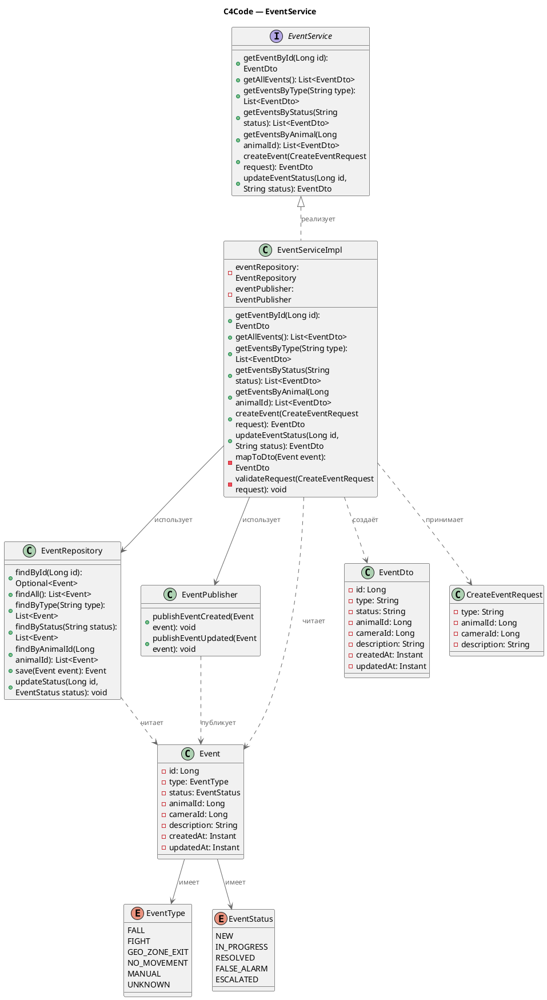

```puml
@startuml
!include <C4/C4_Component>

title C4Code — EventService

interface EventService {
+ getEventById(Long id): EventDto
+ getAllEvents(): List<EventDto>
+ getEventsByType(String type): List<EventDto>
+ getEventsByStatus(String status): List<EventDto>
+ getEventsByAnimal(Long animalId): List<EventDto>
+ createEvent(CreateEventRequest request): EventDto
+ updateEventStatus(Long id, String status): EventDto
}

class EventServiceImpl {
- eventRepository: EventRepository
- eventPublisher: EventPublisher
+ getEventById(Long id): EventDto
+ getAllEvents(): List<EventDto>
+ getEventsByType(String type): List<EventDto>
+ getEventsByStatus(String status): List<EventDto>
+ getEventsByAnimal(Long animalId): List<EventDto>
+ createEvent(CreateEventRequest request): EventDto
+ updateEventStatus(Long id, String status): EventDto
- mapToDto(Event event): EventDto
- validateRequest(CreateEventRequest request): void
}

class EventRepository {
+ findById(Long id): Optional<Event>
+ findAll(): List<Event>
+ findByType(String type): List<Event>
+ findByStatus(String status): List<Event>
+ findByAnimalId(Long animalId): List<Event>
+ save(Event event): Event
+ updateStatus(Long id, EventStatus status): void
}

class EventPublisher {
+ publishEventCreated(Event event): void
+ publishEventUpdated(Event event): void
}

class Event {
- id: Long
- type: EventType
- status: EventStatus
- animalId: Long
- cameraId: Long
- description: String
- createdAt: Instant
- updatedAt: Instant
}

class EventDto {
- id: Long
- type: String
- status: String
- animalId: Long
- cameraId: Long
- description: String
- createdAt: Instant
- updatedAt: Instant
}

class CreateEventRequest {
- type: String
- animalId: Long
- cameraId: Long
- description: String
}

enum EventType {
FALL
FIGHT
GEO_ZONE_EXIT
NO_MOVEMENT
MANUAL
UNKNOWN
}

enum EventStatus {
NEW
IN_PROGRESS
RESOLVED
FALSE_ALARM
ESCALATED
}

EventService <|.. EventServiceImpl : реализует
EventServiceImpl --> EventRepository : использует
EventServiceImpl --> EventPublisher : использует
EventServiceImpl ..> EventDto : создаёт
EventServiceImpl ..> CreateEventRequest : принимает
EventRepository ..> Event : читает
EventServiceImpl ..> Event : читает
EventPublisher ..> Event : публикует
Event --> EventType : имеет
Event --> EventStatus : имеет

@enduml
```