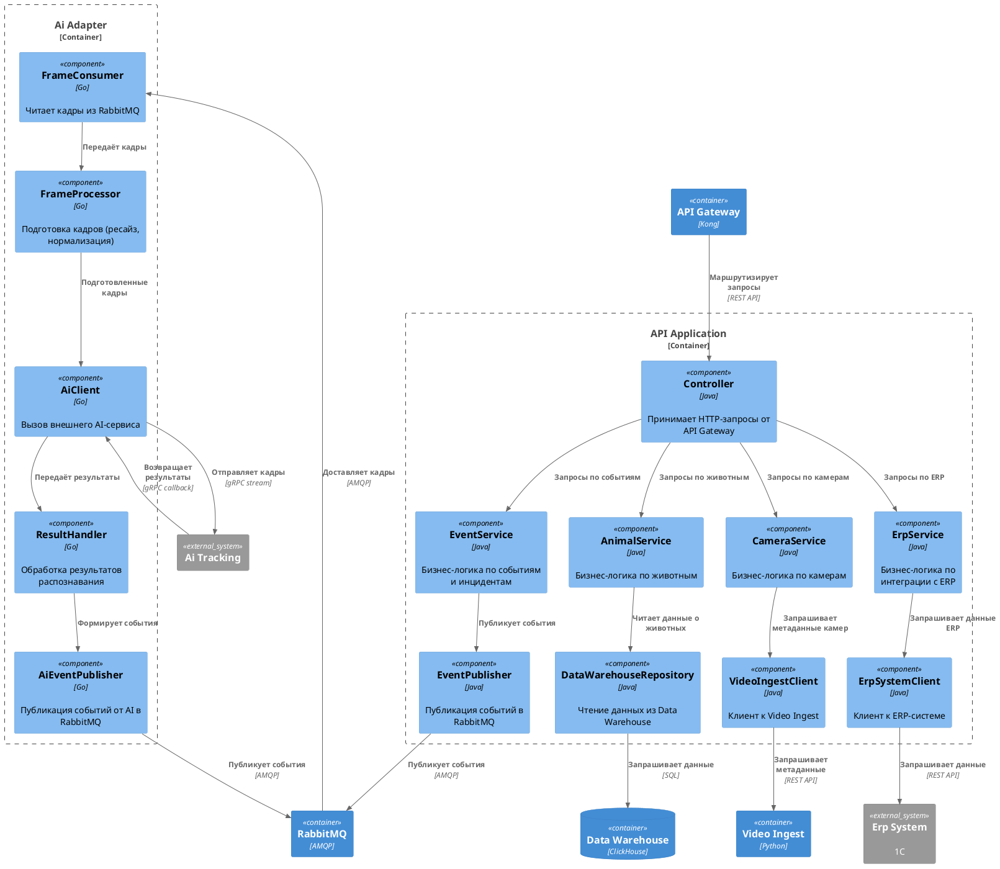

```puml
@startuml
!include <C4/C4_Component>
!$ELEMENT_FONT_SIZE = 10
!$ELEMENT_FONT_COLOR = "#000000"
!$TECH_FONT_SIZE = 8
!$TECH_FONT_COLOR = "#666666"
!$DESCR_FONT_SIZE = 9

!$PERSON_ICON_SIZE = 32
!$SYSTEM_ICON_SIZE = 32
!$EXTERNAL_SYSTEM_ICON_SIZE = 32
!$ICON_SIZE = 32

System_Ext(erpSystem, "Erp System", "1C")
System_Ext(aiTracking, "Ai Tracking")

Container(apiGateWay, "API Gateway", "Kong")
ContainerDb(dataWarehouse, "Data Warehouse", "ClickHouse")
Container(videoIngest, "Video Ingest", "Python")
Container(rabbitMQ, "RabbitMQ", "AMQP")

Container_Boundary(apiApplication, "API Application") {
Component(controller, "Controller", "Java", "Принимает HTTP-запросы от API Gateway")
Component(animalService, "AnimalService", "Java", "Бизнес-логика по животным")
Component(cameraService, "CameraService", "Java", "Бизнес-логика по камерам")
Component(eventService, "EventService", "Java", "Бизнес-логика по событиям и инцидентам")
Component(erpService, "ErpService", "Java", "Бизнес-логика по интеграции с ERP")
Component(dataWarehouseRepository, "DataWarehouseRepository", "Java", "Чтение данных из Data Warehouse")
Component(videoIngestClient, "VideoIngestClient", "Java", "Клиент к Video Ingest")
Component(erpSystemClient, "ErpSystemClient", "Java", "Клиент к ERP-системе")
Component(eventPublisher, "EventPublisher", "Java", "Публикация событий в RabbitMQ")
}

Container_Boundary(aiAdapter, "Ai Adapter") {
Component(frameConsumer, "FrameConsumer", "Go", "Читает кадры из RabbitMQ")
Component(frameProcessor, "FrameProcessor", "Go", "Подготовка кадров (ресайз, нормализация)")
Component(aiClient, "AiClient", "Go", "Вызов внешнего AI-сервиса")
Component(resultHandler, "ResultHandler", "Go", "Обработка результатов распознавания")
Component(aiEventPublisher, "AiEventPublisher", "Go", "Публикация событий от AI в RabbitMQ")
}

Rel(rabbitMQ, frameConsumer, "Доставляет кадры", "AMQP")
Rel(frameConsumer, frameProcessor, "Передаёт кадры")
Rel(frameProcessor, aiClient, "Подготовленные кадры")
Rel(aiClient, aiTracking, "Отправляет кадры", "gRPC stream")
Rel(aiTracking, aiClient, "Возвращает результаты", "gRPC callback")
Rel(aiClient, resultHandler, "Передаёт результаты")
Rel(resultHandler, aiEventPublisher, "Формирует события")
Rel(aiEventPublisher, rabbitMQ, "Публикует события", "AMQP")

Rel(apiGateWay, controller, "Маршрутизирует запросы", "REST API")

Rel(controller, animalService, "Запросы по животным")
Rel(controller, cameraService, "Запросы по камерам")
Rel(controller, eventService, "Запросы по событиям")
Rel(controller, erpService, "Запросы по ERP")

Rel(animalService, dataWarehouseRepository, "Читает данные о животных")
Rel(cameraService, videoIngestClient, "Запрашивает метаданные камер")
Rel(eventService, eventPublisher, "Публикует события")
Rel(erpService, erpSystemClient, "Запрашивает данные ERP")

Rel(dataWarehouseRepository, dataWarehouse, "Запрашивает данные", "SQL")
Rel(videoIngestClient, videoIngest, "Запрашивает метаданные", "REST API")
Rel(erpSystemClient, erpSystem, "Запрашивает данные", "REST API")
Rel(eventPublisher, rabbitMQ, "Публикует события", "AMQP")

@enduml
```