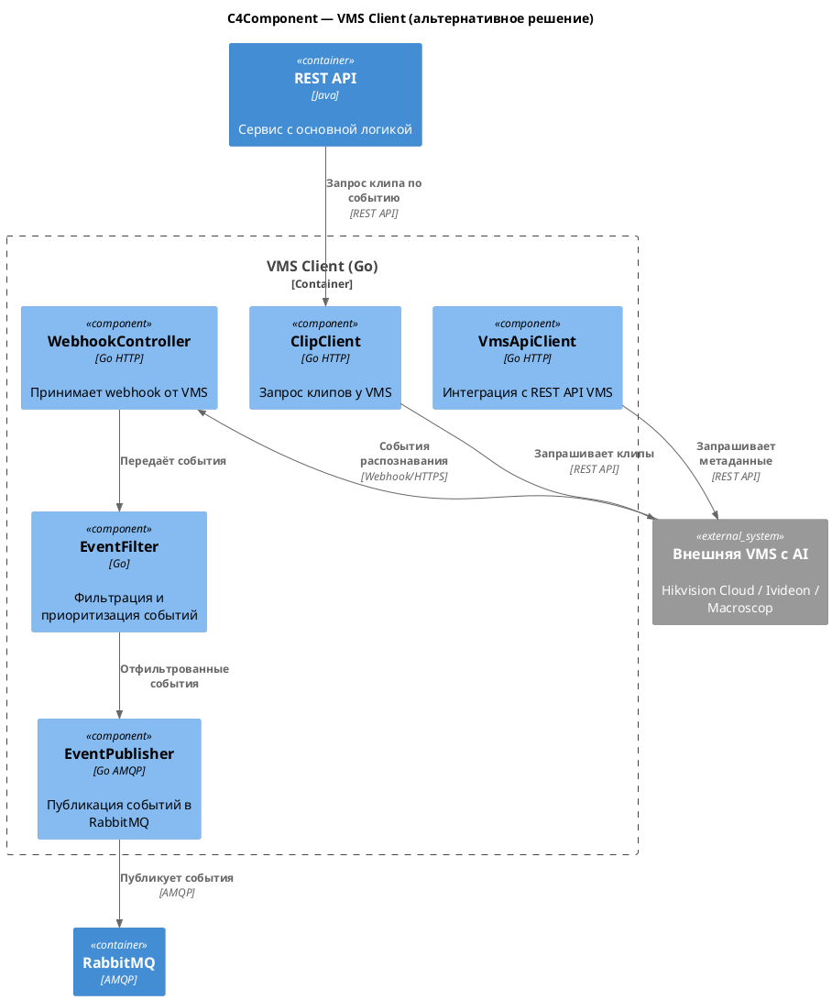

```puml
@startuml
!include <C4/C4_Component>
!$ELEMENT_FONT_SIZE = 10
!$ELEMENT_FONT_COLOR = "#000000"
!$TECH_FONT_SIZE = 8
!$TECH_FONT_COLOR = "#666666"
!$DESCR_FONT_SIZE = 9

!$PERSON_ICON_SIZE = 32
!$SYSTEM_ICON_SIZE = 32
!$EXTERNAL_SYSTEM_ICON_SIZE = 32
!$ICON_SIZE = 32

title C4Component — VMS Client (альтернативное решение)

System_Ext(vms, "Внешняя VMS с AI", "Hikvision Cloud / Ivideon / Macroscop")
Container(rabbitMQ, "RabbitMQ", "AMQP")
Container(coreApi, "REST API", "Java", "Сервис с основной логикой")

Container_Boundary(vmsClient, "VMS Client (Go)") {
Component(webhookController, "WebhookController", "Go HTTP", "Принимает webhook от VMS")
Component(eventFilter, "EventFilter", "Go", "Фильтрация и приоритизация событий")
Component(eventPublisher, "EventPublisher", "Go AMQP", "Публикация событий в RabbitMQ")
Component(clipClient, "ClipClient", "Go HTTP", "Запрос клипов у VMS")
Component(vmsApiClient, "VmsApiClient", "Go HTTP", "Интеграция с REST API VMS")
}

Rel(vms, webhookController, "События распознавания", "Webhook/HTTPS")
Rel(webhookController, eventFilter, "Передаёт события")
Rel(eventFilter, eventPublisher, "Отфильтрованные события")
Rel(eventPublisher, rabbitMQ, "Публикует события", "AMQP")
Rel(clipClient, vms, "Запрашивает клипы", "REST API")
Rel(vmsApiClient, vms, "Запрашивает метаданные", "REST API")
Rel(coreApi, clipClient, "Запрос клипа по событию", "REST API")

@enduml
```